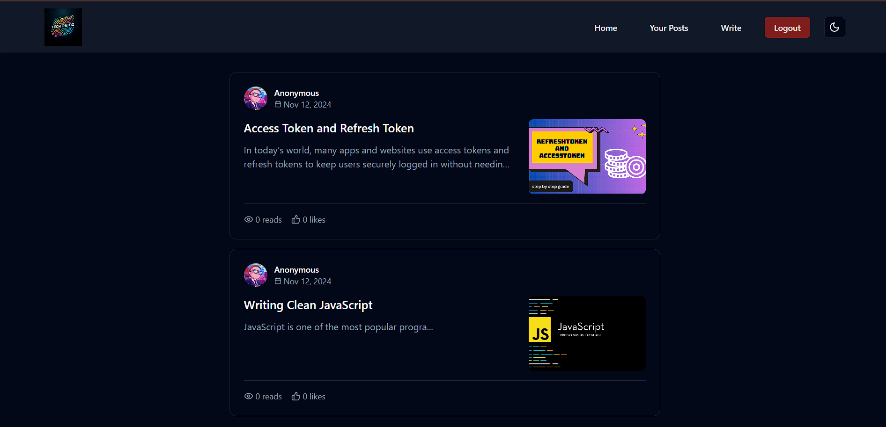
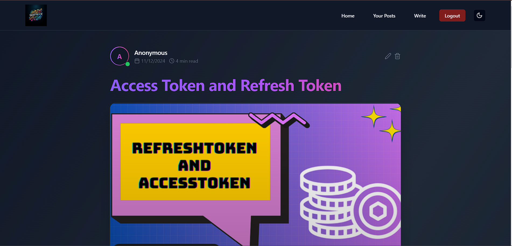
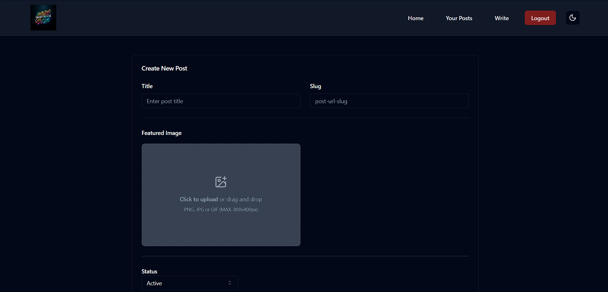
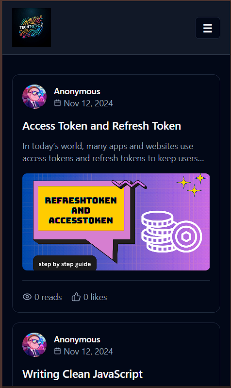
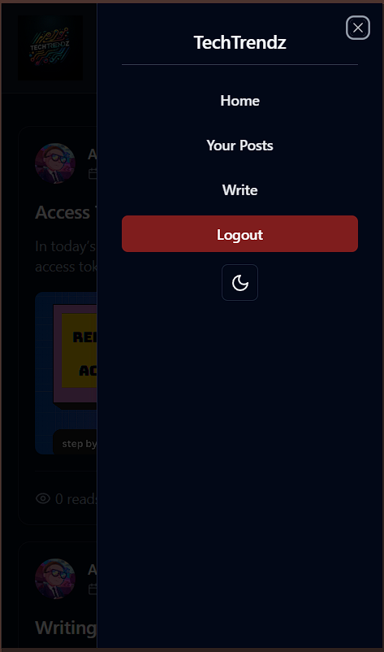
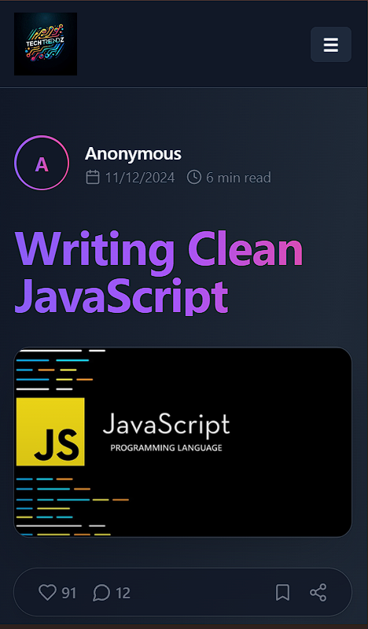
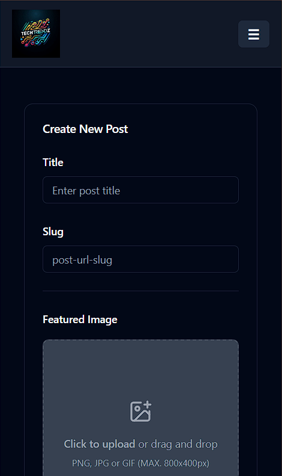
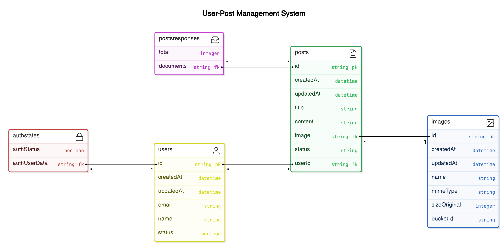

# TechTrendz 🚀

**TechTrendz** is a sleek blogging platform for tech enthusiasts to create, share, and discover articles. Users can enjoy a modern interface, intuitive editing, and personalized theme options.

## Table of Contents

- [✨ Features](#-features)
- [🛠️ Tech Stack](#️-tech-stack)
- [⚙️ Setup and Installation](#️-setup-and-installation)
- [📱 Screens and Functionalities](#-screens-and-functionalities)
- [🖼️ Screenshots](#-screenshots)
  - [Desktop View](#desktop-view)
  - [Mobile View](#mobile-view)
- [📊 Architecture and Data Flow Diagram](#-architecture-and-data-flow-diagram)
- [🤝 Contributing](#-contributing)
- [📄 License](#-license)

## ✨ Features

- **🔐 User Authentication**: Secure sign-up, sign-in, and log out.
- **🏠 Home Feed**: Explore tech blogs viewable by all users.
- **📑 Your Posts**: Manage your posts with visibility settings.
- **✍️ Write Posts**: Rich text editor with TinyMCE for formatting, images, and code.
- **🌗 Theme Toggle**: Dark, light, or system theme for a custom experience.

## 🛠️ Tech Stack

- **Frontend**: ReactJS, Redux, TailwindCSS, Shadcn
- **Backend as a Service**: Appwrite (auth, database, storage)

## ⚙️ Setup and Installation

### Prerequisites

- Node.js (>=14.x), Appwrite setup

### Steps

1. **Clone the Repository**:
   ```bash
   git clone https://github.com/Subrat29/TechTrendz
   cd techtrendz
   ```

2. **Install Dependencies**:
   ```bash
   npm install
   ```

3. **Configure Appwrite**:
   - Setup `.env` with your Appwrite credentials:
     ```bash
     VITE_APPWRITE_URL=""
     VITE_APPWRITE_PROJECT_ID=""
     VITE_APPWRITE_COLLECTION_ID=""
     VITE_APPWRITE_DATABASE_ID=""
     VITE_APPWRITE_BUCKET_ID=""
     VITE_APPWRITE_API_KEY=""
     ```

4. **Run the App**:
   ```bash
   npm start
   ```

## 📱 Screens and Functionalities

1. **Auth (🔐)**: Secure sign in, sign up, and logout with Appwrite.
2. **Home Feed (🏠)**: Discover all active blogs.
3. **Your Posts (📑)**: Manage your authored blogs.
4. **Write Post (✍️)**: Editor for rich content with TinyMCE.
5. **Theme Toggle (🌗)**: Choose dark, light, or system theme.

## 🖼️ Screenshots

### Desktop View

1. **Home Feed**: 
2. **Single Post**: 
3. **Write Post**: 

### Mobile View

1. **Home Feed**: 
2. **Mobile Header**: 
3. **Single Post**: 
4. **Write Post**: 


## 📊 Architecture and Data Flow Diagram

### Overview

- **Frontend**: React, Redux for state, TinyMCE for text editor
- **Backend (Appwrite)**: Manages auth, storage, database

### Data Flow



## 🤝 Contributing

1. Fork and create a new branch.
2. Commit your changes.
3. Push to your branch.
4. Open a Pull Request.

## 📄 License

Distributed under the MIT License. See `LICENSE` for more information.

---

Created with ❤️ by Subrat Yadav

---